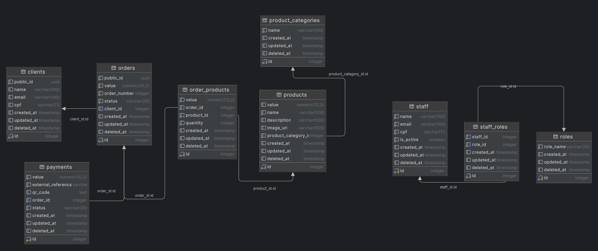

# 📦 FastFood API

Este projeto é uma API RESTful para um sistema de pedidos de fast food, desenvolvida em Java com Spring Boot. A aplicação utiliza PostgreSQL como banco de dados e segue os princípios da Clean Architecture.

## 🚀 Formas de Deploy

A aplicação pode ser executada de diversas formas. Confira abaixo as opções disponíveis e a documentação detalhada para cada uma:

### Executar localmente
- [📄 Deploy com Docker](./docs/docker.md)

### Pipeline integrada ao DockerHub

Esta aplicação possui uma imagem Docker, assim como uma pipeline de CI/CD configurada para deploy automático no DockerHub a cada push na branch `main`.

Esta pipeline realiza as seguintes etapas:

1. **Teste**: Executa e valida todos os testes unitários do projeto.
2. **Build**: Compila o projeto e cria a imagem Docker.
3. **Trivy**: Valida as vulnerabilidades da imagem Docker.
4. **Push**: Envia a imagem Docker para o DockerHub.
5. **Notificação**: Envia uma notificação no Discord informando sobre o sucesso ou falha do deploy.

## 🧪 Testes

### ✅ Testes Unitários

Execute os testes unitários com o seguinte comando:

```bash
./gradlew test
```

### 🔁 Testes de Integração

Execute os testes de integração com o seguinte comando:

```bash
./gradlew testIntegration
```

Mais detalhes em: [📄 Documentação de Testes de Integração](./docs/integration-tests.md)

## 📚 Swagger

A documentação da API está disponível via Swagger, acessível em:

```
http://localhost:8080/api/swagger-ui/index.html
```

## 🗃️ Diagrama do Banco de Dados



- [🔗 Acessar diagrama interativo](https://dbdiagram.io/d/FIAP-HEX-68101c011ca52373f5ba7756)

## 🧭 Diagrama DDD

- [🖼️ Visualizar Diagrama DDD (arquivo Draw.io)](./docs/diagrama-ddd.drawio)
- [🔗 Acessar no Google Drive](https://drive.google.com/file/d/1jAH0o1r2prv5UD3AY6mZ57Uc93uPAPi9/view?usp=sharing)